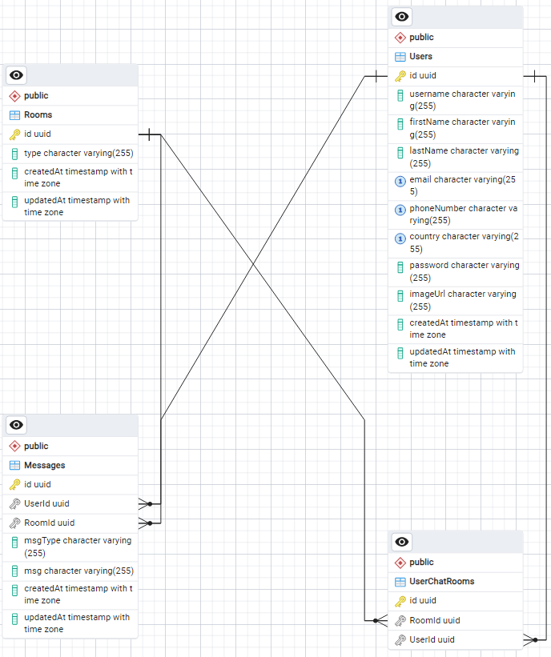

## Connectme-be

## Framework and language: 
- **Typescript**: easier to determine and detect variable type
- **ExpressJS**: quick and easier with small project compared to NestJS

## Features

- **Authentication and authorization**: using JWT, bcrypt
- **Implememented error handling and validation**: using Express-validator
- **Implemented connection pool with Sequzlize**
- **Implemented transaction**: see src/services/ChatService.ts function **CreateRoom**
- **Implemented bi-directional communication**: using [Socketio](https://socket.io/)
- **Implemented Multiple chat rooms**
- **Implemented message encryption / decryption**: using CryptoJS

## Deployment
- **Deployed to Heroku**: quick and require little setup

## Database ERD 
